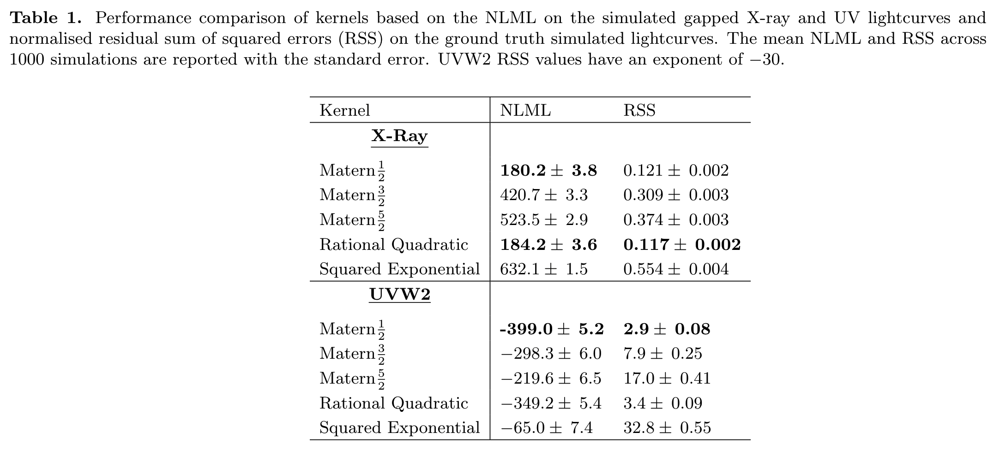

# Modelling the Multiwavelength Variability of Mrk-335 using Gaussian Processes

[](LICENSE)

This repo contains all source code for the paper "Modelling the Multiwavelength Variability of Mrk 335 using Gaussian Processes
" available here ([https://iopscience.iop.org/article/10.3847/1538-4357/abfa9f/meta](https://iopscience.iop.org/article/10.3847/1538-4357/abfa9f/meta)). We interpolate the gaps in the observational
lightcurves of Mrk 335 using a Gaussian process and use these "GP Lightcurves" to perform a 
cross-correlation analysis. The (purely decorative) gif below illustrates the resampling procedure for obtaining bootstrap uncertainty estimates
on the parameters of power law fits (black) to a Gaussian process structure function (red).

<p align="center">
  
</p>

## Installation

We recommend using a conda environment.

```
conda create -n mrk python==3.7
conda install astropy scikit-learn matplotlib
conda install -c conda-forge statsmodels
pip install git+https://github.com/GPflow/GPflow.git@develop#egg=gpflow
pip install scipy
```

## Gaussian Process Fitting to Observational Data

The gp_fit_real_data folder contains the code for fitting Gaussian processes to
the observational data

X-ray            |  UVW2
:-------------------------:|:-------------------------:
|    

## Lightcurve Simulations

The simulations folder contains code for performing lightcurve simulations according
to the Timmer and Konig algorithm.



## Structure Function Computation

The structure_function folder contains the code for computing structure functions
of both the observational lightcurves and the Gaussian process-interpolated lightcurves
of Mrk 335.


## Log-Normality Tests

The folder log_normal_tests contains code for distribution testing of the observational
data from Mrk 335, including both graphical distribution tests such as PP-plots, ECDFs and histograms
as well as statistical hypothesis testing using the Kolmogorov-Smirnov test.


## Citing

If you find this code useful please consider citing the following paper

```
@article{griffiths2021modeling,
  title={Modeling the Multiwavelength Variability of Mrk 335 Using Gaussian Processes},
  author={Griffiths, Ryan-Rhys and Jiang, Jiachen and Buisson, Douglas JK and Wilkins, Dan and Gallo, Luigi C and Ingram, Adam and Grupe, Dirk and Kara, Erin and Parker, Michael L and Alston, William and others},
  journal={The Astrophysical Journal},
  volume={914},
  number={2},
  pages={144},
  year={2021},
  publisher={IOP Publishing}
}
```
