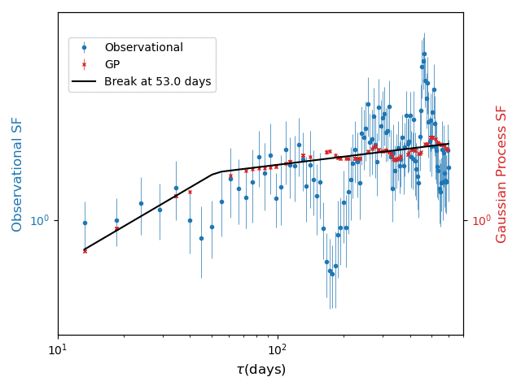
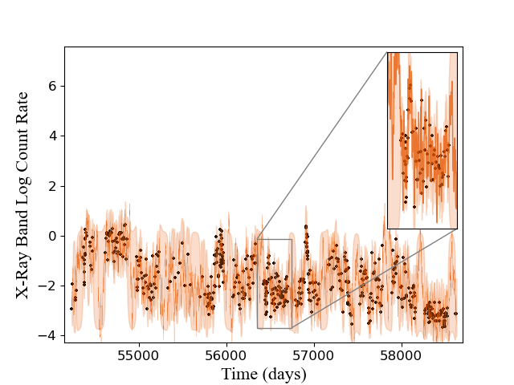
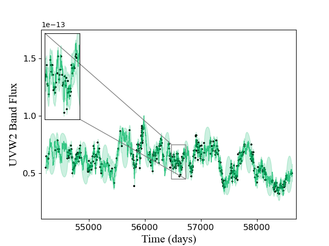
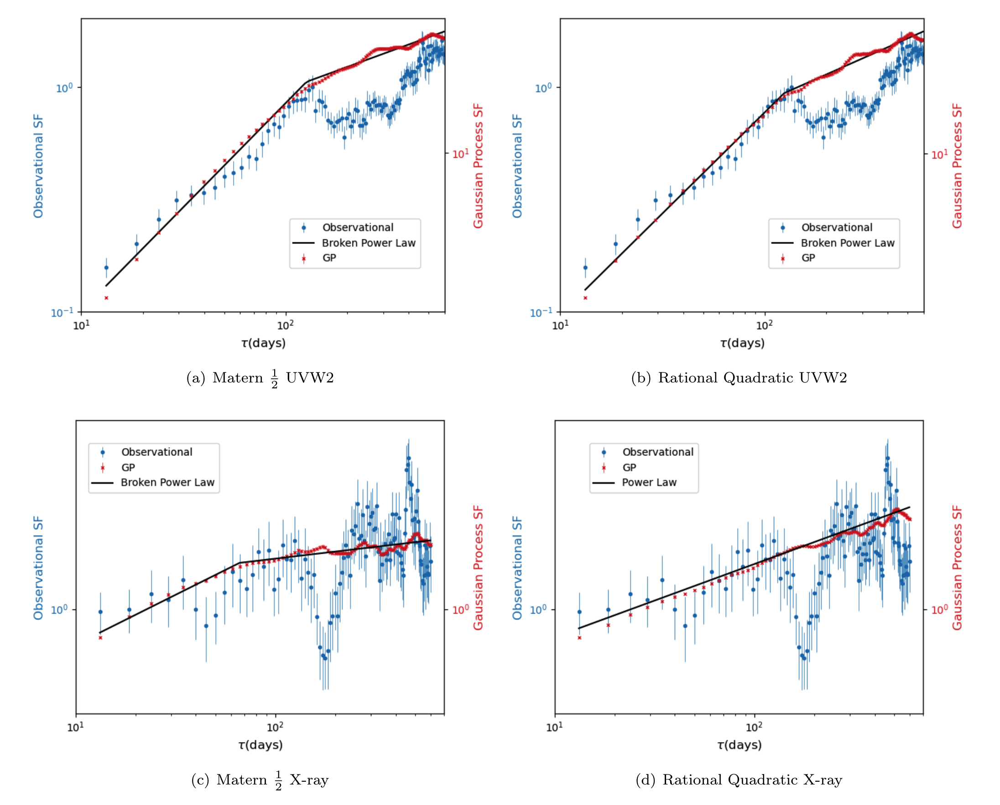
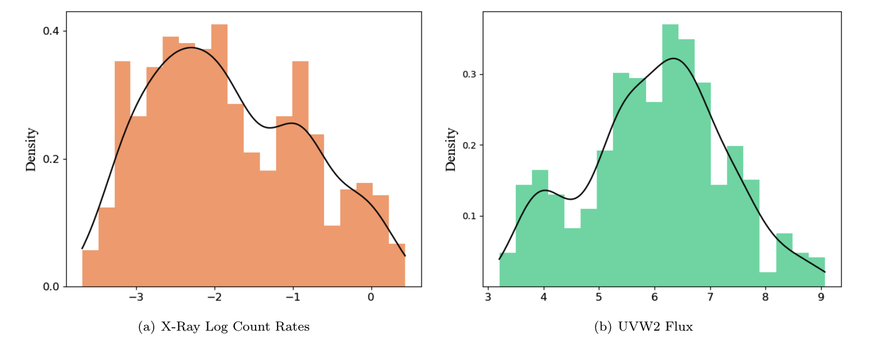

# Modelling the Multiwavelength Variability of Mrk-335 using Gaussian Processes

[](LICENSE)

This code repository contains all source code for the paper given in the title, where we interpolate the gaps in the observational
lightcurves of Mrk 335 using a Gaussian process and use these "GP Lightcurves" to perform a 
cross-correlation analysis.

|


## Installation

```
conda create -n mrk python==3.7
conda install astropy scikit-learn matplotlib
conda install -c conda-forge statsmodels
pip install git+https://github.com/GPflow/GPflow.git@develop#egg=gpflow
pip install scipy
```

## Gaussian Process Fitting to Observational Data

X-ray            |  UVW2
:-------------------------:|:-------------------------:
|    

## Lightcurve Simulations

The simulations folder contains code for performing lightcurve simulations according
to the Timmer and Konig algorithm.

## Structure Function Computation

|

## Autocorrelation

## Log-Normality Tests

The folder log_normal_tests contains code for distribution testing of the observational
data from Mrk 335.

|
